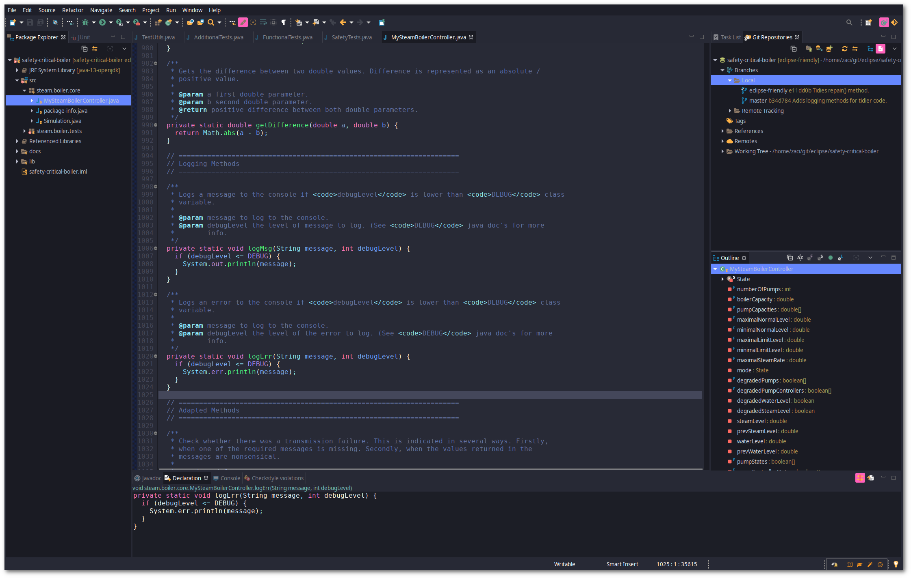

# Dracula for [Eclipse](https://www.eclipse.org/)

> A dark theme for [Eclipse](https://www.eclipse.org/).

## Install

All instructions can be found at [draculatheme.com/eclipse](https://draculatheme.com/eclipse).

## Team

This theme is maintained by the following person(s) and a bunch of [awesome contributors](https://github.com/dracula/eclipse/graphs/contributors).

 |
--- |
[Zac Scott](https://github.com/scottzach1) |

## License

[MIT License](./LICENSE)
